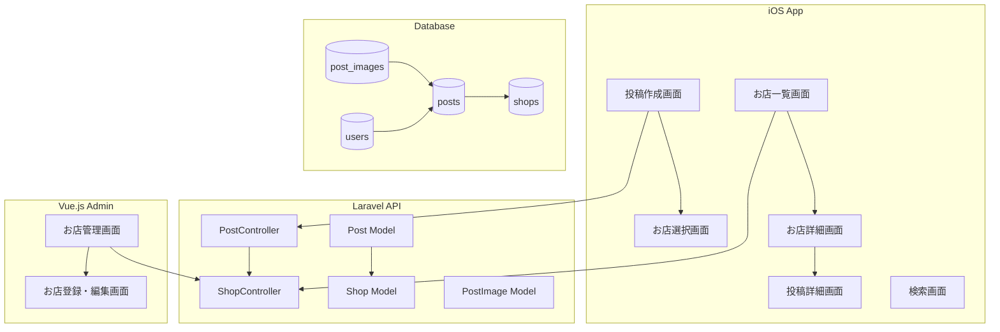
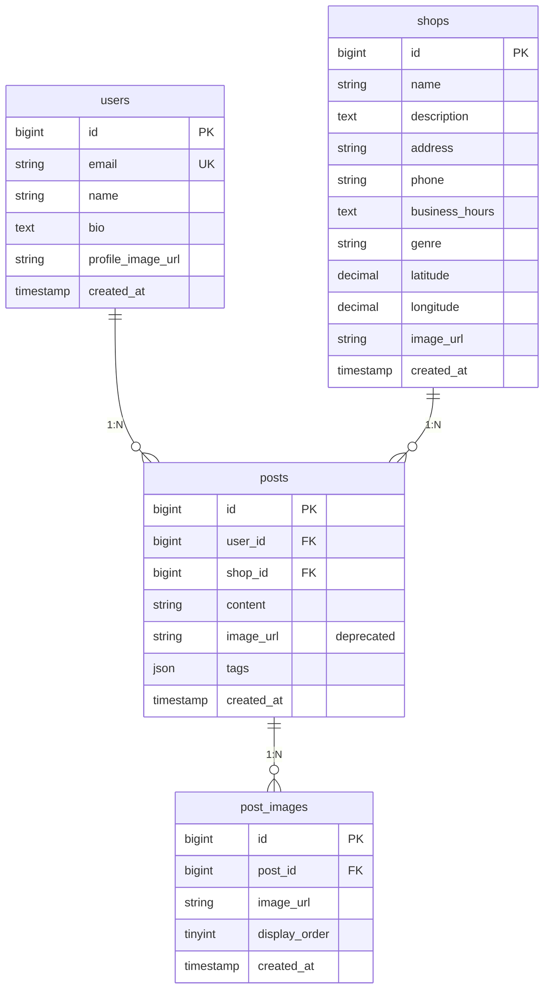

# 設計書

## 概要

投稿・お店管理システムは、ユーザーがお店での体験を複数の写真と共に投稿し、お店情報を管理する機能を提供します。既存のHidamariアプリの投稿機能を拡張し、お店との関連付けを追加します。

## アーキテクチャ

### システム構成



### 技術スタック

- **iOS**: Swift, SwiftUI
- **API**: Laravel 10, PHP 8.2
- **Admin**: Vue.js 3, Vite
- **Database**: MySQL 8.0
- **Storage**: ローカルストレージ（画像保存）

## コンポーネントとインターフェース

### データベース設計

#### 新規テーブル: shops

```sql
CREATE TABLE shops (
    id BIGINT UNSIGNED AUTO_INCREMENT PRIMARY KEY,
    name VARCHAR(100) NOT NULL,
    description TEXT,
    address VARCHAR(255),
    phone VARCHAR(20),
    business_hours TEXT,
    genre VARCHAR(50),
    latitude DECIMAL(10, 8),
    longitude DECIMAL(11, 8),
    image_url VARCHAR(2048),
    created_at TIMESTAMP NULL DEFAULT NULL,
    updated_at TIMESTAMP NULL DEFAULT NULL,
    INDEX idx_genre (genre),
    INDEX idx_location (latitude, longitude)
);
```

#### 新規テーブル: post_images

```sql
CREATE TABLE post_images (
    id BIGINT UNSIGNED AUTO_INCREMENT PRIMARY KEY,
    post_id BIGINT UNSIGNED NOT NULL,
    image_url VARCHAR(2048) NOT NULL,
    display_order TINYINT UNSIGNED DEFAULT 1,
    created_at TIMESTAMP NULL DEFAULT NULL,
    updated_at TIMESTAMP NULL DEFAULT NULL,
    FOREIGN KEY (post_id) REFERENCES posts(id) ON DELETE CASCADE,
    INDEX idx_post_id (post_id)
);
```

#### 既存テーブル修正: posts

```sql
ALTER TABLE posts 
ADD COLUMN shop_id BIGINT UNSIGNED NULL AFTER user_id,
ADD FOREIGN KEY (shop_id) REFERENCES shops(id) ON DELETE SET NULL,
MODIFY COLUMN image_url VARCHAR(2048) NULL COMMENT 'Deprecated: use post_images table',
ADD INDEX idx_shop_id (shop_id);
```

### API エンドポイント設計

#### 投稿関連 API

```php
// 投稿作成
POST /api/posts
{
    "content": "string (max: 500)",
    "shop_id": "integer|nullable",
    "images": ["file", "file", ...] // max 5 files
}

// 投稿一覧（お店別）
GET /api/shops/{shop_id}/posts?page=1&per_page=10

// 投稿詳細
GET /api/posts/{id}

// 投稿更新
PUT /api/posts/{id}
{
    "content": "string (max: 500)",
    "shop_id": "integer|nullable"
}

// 投稿削除
DELETE /api/posts/{id}
```

#### お店関連 API

```php
// お店一覧
GET /api/shops?genre=string&lat=float&lng=float&radius=integer&page=1

// お店詳細
GET /api/shops/{id}

// お店検索
GET /api/shops/search?q=string&page=1
```

#### 管理者用 API

```php
// お店管理
POST /api/admin/shops
PUT /api/admin/shops/{id}
DELETE /api/admin/shops/{id}
GET /api/admin/shops?page=1
```

### iOS モデル設計

#### Shop モデル

```swift
struct Shop: Identifiable, Codable {
    var id: Int
    var name: String
    var description: String?
    var address: String?
    var phone: String?
    var businessHours: String?
    var genre: String?
    var latitude: Double?
    var longitude: Double?
    var imageUrl: String?
    var createdAt: Date?
    var updatedAt: Date?
    
    enum CodingKeys: String, CodingKey {
        case id, name, description, address, phone, genre, latitude, longitude
        case businessHours = "business_hours"
        case imageUrl = "image_url"
        case createdAt = "created_at"
        case updatedAt = "updated_at"
    }
}
```

#### PostImage モデル

```swift
struct PostImage: Identifiable, Codable {
    var id: Int
    var postId: Int
    var imageUrl: String
    var displayOrder: Int
    var createdAt: Date?
    var updatedAt: Date?
    
    enum CodingKeys: String, CodingKey {
        case id
        case postId = "post_id"
        case imageUrl = "image_url"
        case displayOrder = "display_order"
        case createdAt = "created_at"
        case updatedAt = "updated_at"
    }
}
```

#### Post モデル拡張

```swift
struct Post: Identifiable, Codable {
    var id: Int
    var userId: Int?
    var shopId: Int?
    var content: String
    var imageUrl: String? // Deprecated
    var tags: [String]?
    var createdAt: Date?
    var updatedAt: Date?
    
    // 関連データ
    var user: User?
    var shop: Shop?
    var images: [PostImage]?
    
    enum CodingKeys: String, CodingKey {
        case id
        case userId = "user_id"
        case shopId = "shop_id"
        case content
        case imageUrl = "image_url"
        case tags
        case createdAt = "created_at"
        case updatedAt = "updated_at"
        case user, shop, images
    }
}
```

### Laravel モデル設計

#### Shop モデル

```php
class Shop extends Model
{
    protected $fillable = [
        'name', 'description', 'address', 'phone', 
        'business_hours', 'genre', 'latitude', 
        'longitude', 'image_url'
    ];

    protected $casts = [
        'latitude' => 'decimal:8',
        'longitude' => 'decimal:8',
    ];

    public function posts()
    {
        return $this->hasMany(Post::class);
    }
}
```

#### PostImage モデル

```php
class PostImage extends Model
{
    protected $fillable = [
        'post_id', 'image_url', 'display_order'
    ];

    public function post()
    {
        return $this->belongsTo(Post::class);
    }
}
```

#### Post モデル拡張

```php
class Post extends Model
{
    protected $fillable = [
        'content', 'image_url', 'tags', 'shop_id'
    ];

    protected $casts = [
        'tags' => 'array',
    ];

    public function user()
    {
        return $this->belongsTo(User::class);
    }

    public function shop()
    {
        return $this->belongsTo(Shop::class);
    }

    public function images()
    {
        return $this->hasMany(PostImage::class)->orderBy('display_order');
    }
}
```

## データモデル

### エンティティ関係図



### データ制約

- 投稿の写真は最大5枚まで
- 投稿のテキストは最大500文字
- お店名は最大100文字
- 画像URLは最大2048文字
- 緯度経度は小数点以下8桁まで

## エラーハンドリング

### API エラーレスポンス

```json
{
    "error": {
        "code": "VALIDATION_ERROR",
        "message": "入力データに問題があります",
        "details": {
            "content": ["投稿内容は500文字以内で入力してください"],
            "images": ["画像は最大5枚まで選択できます"]
        }
    }
}
```

### エラーコード定義

- `VALIDATION_ERROR`: バリデーションエラー
- `SHOP_NOT_FOUND`: お店が見つからない
- `POST_NOT_FOUND`: 投稿が見つからない
- `UNAUTHORIZED`: 認証エラー
- `FORBIDDEN`: 権限エラー
- `IMAGE_UPLOAD_FAILED`: 画像アップロードエラー
- `LOCATION_SERVICE_ERROR`: 位置情報サービスエラー

### iOS エラーハンドリング

```swift
enum PostError: Error, LocalizedError {
    case invalidImageCount
    case contentTooLong
    case shopNotFound
    case uploadFailed
    case networkError
    
    var errorDescription: String? {
        switch self {
        case .invalidImageCount:
            return "画像は1枚以上5枚以下で選択してください"
        case .contentTooLong:
            return "投稿内容は500文字以内で入力してください"
        case .shopNotFound:
            return "選択されたお店が見つかりません"
        case .uploadFailed:
            return "投稿のアップロードに失敗しました"
        case .networkError:
            return "ネットワークエラーが発生しました"
        }
    }
}
```

## テスト戦略

### 単体テスト

#### Laravel API テスト

```php
// PostControllerTest.php
public function test_create_post_with_multiple_images()
public function test_create_post_with_shop()
public function test_update_post_content()
public function test_delete_post_removes_images()

// ShopControllerTest.php
public function test_get_shops_by_genre()
public function test_get_shops_by_location()
public function test_search_shops_by_keyword()
```

#### iOS 単体テスト

```swift
// PostViewModelTests.swift
func testCreatePostWithMultipleImages()
func testValidatePostContent()
func testUploadPostImages()

// ShopServiceTests.swift
func testFetchShopsByGenre()
func testSearchShops()
func testCalculateDistance()
```

### 統合テスト

- 投稿作成から表示までの一連の流れ
- お店選択から投稿作成までの流れ
- 画像アップロードとリサイズ処理
- 位置情報を使った近くのお店検索

### E2Eテスト

- ユーザーが投稿を作成し、お店詳細画面で確認できる
- 管理者がお店を登録し、ユーザーが投稿時に選択できる
- 複数の画像を含む投稿が正しく表示される
- 検索機能で投稿とお店が適切に検索される

### パフォーマンステスト

- 大量の投稿データでのお店詳細画面の表示速度
- 画像の読み込み速度とメモリ使用量
- 位置情報検索のレスポンス時間
- データベースクエリの最適化確認