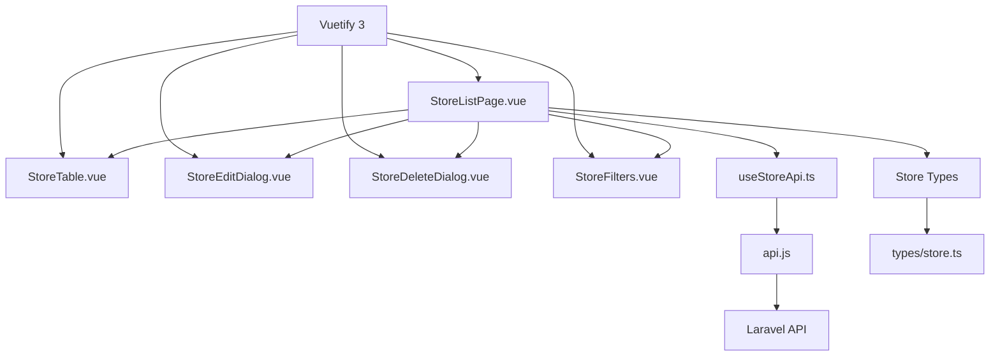

# Design Document

## Overview

The Store Management System is a comprehensive Vue 3 + TypeScript application that provides administrators with full CRUD capabilities for managing store data. The system integrates with the existing Laravel API backend and follows modern frontend architecture patterns including composables, proper TypeScript typing, and Vuetify 3 components.

The design emphasizes maintainability, type safety, and user experience while leveraging the existing project infrastructure including axios interceptors, error handling utilities, and API service patterns.

## Architecture

### High-Level Architecture



### Component Hierarchy

- **StoreListPage.vue** (Main container)
  - **StoreFilters.vue** (Search and filter controls)
  - **StoreTable.vue** (Data table with actions)
  - **StoreEditDialog.vue** (Edit modal)
  - **StoreDeleteDialog.vue** (Delete confirmation)

### Technology Stack Integration

- **Vue 3 Composition API** with TypeScript for reactive state management
- **Vuetify 3** for UI components (v-data-table, v-dialog, v-form, etc.)
- **Axios** for HTTP requests via existing api.js service
- **Vue Router** for navigation to coupon management
- **Existing error handling** utilities for consistent error management

## Components and Interfaces

### 1. StoreListPage.vue (Main Container)

**Purpose**: Main page component that orchestrates all store management functionality

**Key Features**:
- Manages global state for stores, loading, and error states
- Coordinates between child components
- Handles pagination and data fetching
- Provides navigation context

**Props**: None (route-based)

**Emits**: None

**Composables Used**:
- `useStoreApi()` for API operations
- `useRouter()` for navigation

### 2. StoreTable.vue (Data Display)

**Purpose**: Displays store data in a Vuetify v-data-table with sorting and actions

**Key Features**:
- Sortable columns for all store fields
- Action buttons for edit, delete, and coupon management
- Responsive design with mobile-friendly layouts
- Loading states and empty state handling

**Props**:
```typescript
interface Props {
  stores: Store[]
  loading: boolean
  sortBy: string
  sortDesc: boolean
}
```

**Emits**:
```typescript
interface Emits {
  'edit-store': (store: Store) => void
  'delete-store': (store: Store) => void
  'sort-change': (sortBy: string, sortDesc: boolean) => void
}
```

### 3. StoreFilters.vue (Search and Filter)

**Purpose**: Provides search and filtering controls for the store list

**Key Features**:
- Real-time search by store name
- Filter dropdowns for city/ward, genre, and Try benefits
- Clear filters functionality
- Debounced search input

**Props**:
```typescript
interface Props {
  modelValue: StoreFilters
}
```

**Emits**:
```typescript
interface Emits {
  'update:modelValue': (filters: StoreFilters) => void
}
```

### 4. StoreEditDialog.vue (Edit Modal)

**Purpose**: Modal dialog for editing store information

**Key Features**:
- Form validation using Vuetify rules
- Pre-populated form fields
- Save and cancel actions
- Loading states during API calls

**Props**:
```typescript
interface Props {
  modelValue: boolean
  store: Store | null
}
```

**Emits**:
```typescript
interface Emits {
  'update:modelValue': (value: boolean) => void
  'store-updated': (store: Store) => void
}
```

### 5. StoreDeleteDialog.vue (Delete Confirmation)

**Purpose**: Confirmation dialog for store deletion

**Key Features**:
- Clear confirmation message with store name
- Warning about irreversible action
- Loading state during deletion

**Props**:
```typescript
interface Props {
  modelValue: boolean
  store: Store | null
}
```

**Emits**:
```typescript
interface Emits {
  'update:modelValue': (value: boolean) => void
  'store-deleted': (storeId: number) => void
}
```

## Data Models

### Store Type Definition

```typescript
// types/store.ts
export interface Store {
  id: number
  name: string
  description: string | null
  address: string | null
  phone: string | null
  business_hours: string | null
  genre: string | null
  latitude: number | null
  longitude: number | null
  image_url: string | null
  created_at: string
  updated_at: string
  
  // Computed fields
  city?: string // Extracted from address
  has_try_benefit?: boolean // Based on business logic
  status?: 'active' | 'inactive' // Based on business logic
}

export interface StoreFilters {
  search: string
  genre: string
  city: string
  has_try_benefit: boolean | null
}

export interface StoreListResponse {
  data: Store[]
  meta: {
    current_page: number
    last_page: number
    per_page: number
    total: number
  }
}

export interface StoreApiResponse {
  data: Store
  message: string
}
```

### API Integration Types

```typescript
// types/api.ts
export interface ApiResponse<T> {
  data: T
  message?: string
}

export interface PaginatedResponse<T> {
  data: T[]
  meta: {
    current_page: number
    last_page: number
    per_page: number
    total: number
    from: number
    to: number
  }
}

export interface ApiError {
  message: string
  errors?: Record<string, string[]>
}
```

## Error Handling

### Error Handling Strategy

The system leverages existing error handling utilities while adding store-specific error handling:

1. **Network Errors**: Use existing `isNetworkOnline()` and `handleApiErrorWithRetry()`
2. **Validation Errors**: Display field-specific errors from Laravel validation
3. **Permission Errors**: Handle 401/403 responses with appropriate messaging
4. **Generic Errors**: Use existing `handleApiError()` with store-specific context

### Error Display Patterns

- **Global Errors**: Toast notifications for API failures
- **Form Errors**: Inline validation messages in edit dialog
- **Loading States**: Skeleton loaders and disabled states
- **Empty States**: Friendly messages when no stores match filters

## Testing Strategy

### Unit Testing Approach

1. **Composables Testing**:
   - Mock axios responses for all API operations
   - Test error handling scenarios
   - Verify reactive state updates

2. **Component Testing**:
   - Test user interactions (clicks, form inputs)
   - Verify prop/emit contracts
   - Test conditional rendering

3. **Integration Testing**:
   - Test complete user workflows
   - Verify API integration
   - Test error recovery scenarios

### Test Structure

```
tests/
├── unit/
│   ├── composables/
│   │   └── useStoreApi.spec.ts
│   └── components/
│       ├── StoreTable.spec.ts
│       ├── StoreEditDialog.spec.ts
│       └── StoreFilters.spec.ts
└── integration/
    └── StoreManagement.spec.ts
```

## Implementation Considerations

### Performance Optimizations

1. **Pagination**: Server-side pagination to handle large datasets
2. **Debounced Search**: Prevent excessive API calls during typing
3. **Lazy Loading**: Load store details only when needed
4. **Caching**: Consider implementing store list caching for better UX

### Accessibility Features

1. **Keyboard Navigation**: Full keyboard support for all interactions
2. **Screen Reader Support**: Proper ARIA labels and descriptions
3. **Focus Management**: Logical focus flow in modals and forms
4. **Color Contrast**: Ensure all text meets WCAG guidelines

### Mobile Responsiveness

1. **Responsive Table**: Stack columns on mobile devices
2. **Touch-Friendly**: Larger touch targets for mobile users
3. **Swipe Actions**: Consider swipe gestures for edit/delete on mobile
4. **Optimized Modals**: Full-screen modals on small screens

### Security Considerations

1. **Input Validation**: Client-side validation with server-side verification
2. **XSS Prevention**: Proper escaping of user-generated content
3. **CSRF Protection**: Leverage Laravel's built-in CSRF protection
4. **Authorization**: Verify admin permissions for all operations

## Migration from Existing Code

### Current State Analysis

The existing `ShopList.vue` provides a solid foundation with:
- Basic CRUD operations
- Search and filtering
- Pagination
- Error handling integration

### Migration Strategy

1. **Preserve Existing Functionality**: Maintain all current features
2. **Enhance with Vuetify**: Replace custom components with Vuetify equivalents
3. **Add TypeScript**: Gradually introduce type safety
4. **Improve UX**: Add loading states, better error handling, and responsive design
5. **Modularize**: Extract reusable components and composables

### Breaking Changes

- Component structure will change (new child components)
- Some CSS classes may change due to Vuetify integration
- API service will be enhanced with better typing

### Backward Compatibility

- Maintain existing API endpoints and response formats
- Preserve existing error handling patterns
- Keep existing routing structure